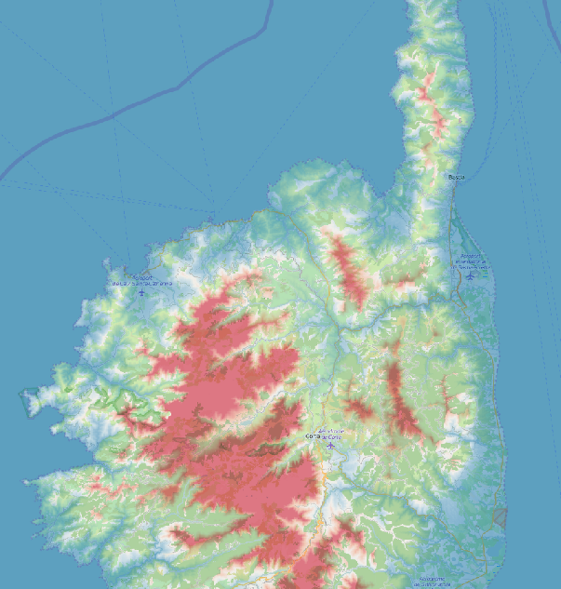

# Modèle Numérique de Terrain (SRTM 90) avec Postgis

## Description

Crée une machine virtuelle avec postgreSQL et postGIS (vagrant)
Télécharge 2 tuiles SRTM (Bretagne et Corse).
Les intègre dans Postgis (raster2pgsql)

## Installation

Installation de vagrant préalable, VM 64 bits. https://www.vagrantup.com/

```bash
git clone https://github.com/eric-pommereau/mnt_france_srtm_90
cd mnt_france_srtm_90
vagrant up
```

Il est possible de se connecter depuis l'hôte : 
```bash
psql -U srtm -p 5434
```
Détails de l'installation : [bootstrap.sh](./vagrant-provision/bootstrap.sh)

## Résultat
### BDD
Tuiles pré-chargées -> bretagne et corse :
```sql
WITH point AS ( 
        SELECT 'Corse (Capu Ucellu)' as lieu, st_geomfromtext('POINT (8.87895 42.34474)', 4326) AS geom UNION
        SELECT 'Bretagne (Menez Hom)' as lieu, st_geomfromtext('POINT (-4.23425 48.22016)', 4326) AS geom
)
SELECT point.lieu, st_value(rast, geom) as altitude, st_summarystats(srtm.rast) as statistiques
FROM point JOIN srtm_metro srtm ON st_intersects(srtm.rast, point.geom);
```

```bash
==> default:          lieu         | altitude |                       statistiques                        
==> default: ----------------------+----------+-----------------------------------------------------------
==> default:  Bretagne (Menez Hom) |      325 | (900,202665,225.183333333333,40.5235836684434,147,325)
==> default:  Corse (Capu Ucellu)  |     2238 | (900,1651039,1834.48777777778,243.648136243768,1341,2500)
==> default: (2 rows)
```
### Dans QGIS, visualisation du MNT




